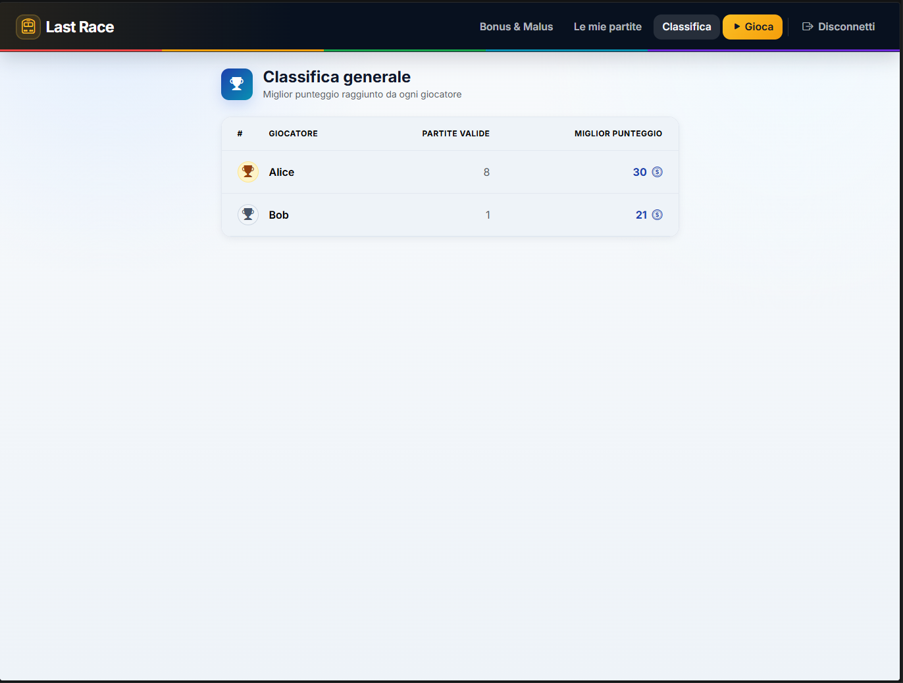
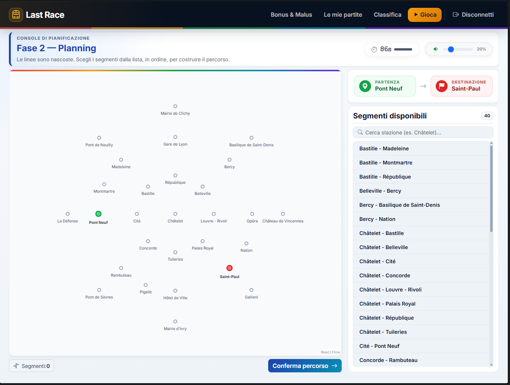
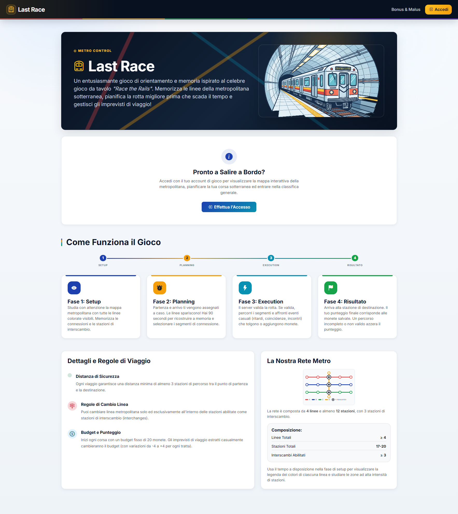
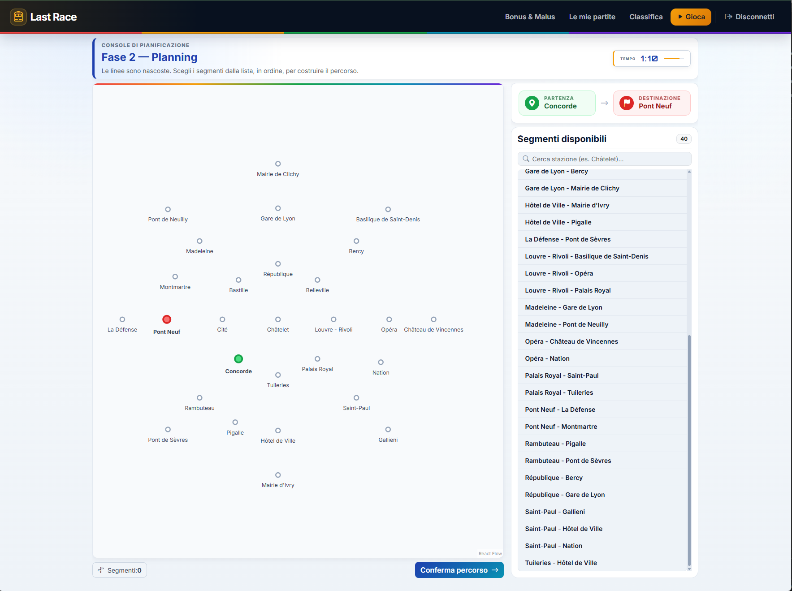

# Exam #1: "Last Race"
## Student: s361878 BOR ALBERTO

> **Required launch commands:** `cd server && npm install && nodemon index.js` (port 3001), then `cd client && npm install && npm run dev` (port 5173).  
> The backend can also be started without Nodemon by running `cd server && npm run dev`.
> The pre-seeded SQLite database is included in the repository as `server/database.db`.

---

## React Client Application Routes

| Route | Description | Access |
|-------|-------------|---------|
| `/` | Home page with game instructions. Authenticated users also see actions to start a game and open the ranking. | Everyone |
| `/login` | Login form with email and password. Already authenticated users are redirected to `/game`. | Everyone |
| `/game` | Full game flow: Setup, Planning (90 seconds), Execution, and Result. | Registered users only |
| `/ranking` | General ranking showing the best score for each player. | Registered users only |
| `/history` | Paginated personal game history. | Registered users only |
| `/events` | List of all bonus and malus events with description and coin effect. | Registered users only |
| `*` | Unknown routes redirect to `/`. | Everyone |

---

## API Server

Common prefix: `/api/`. Authentication uses Passport.js with session cookies. Protected routes use the `isLoggedIn` middleware.

### Authentication

- **GET `/api/sessions/current`**
  - Parameters: none.
  - Response (200): `{ loggedIn: true, user: { id, email, name } }`
  - Response (401): `{ loggedIn: false, user: null }`

- **POST `/api/sessions`**
  - Body: `{ email: string, password: string }`
  - Response (200): `{ loggedIn: true, user: { id, email, name } }`
  - Response (401): `{ message: string }`

- **DELETE `/api/sessions/current`**
  - Parameters: none.
  - Response (204): no body.

### Network, Events, and Ranking

- **GET `/api/network`** *(protected)*
  - Response (200): `{ lines, stations, stationLines, segments }`, where `segments` is an array of `{ from_station_id, to_station_id }`.

- **GET `/api/ranking`** *(protected)*
  - Response (200): array of `{ user_id, name, best_score, games_played }`, ordered by decreasing `best_score`.

- **GET `/api/events`** *(protected)*
  - Response (200): array of `{ id, description, effect }`, where `effect` is an integer from -4 to +4.

### Games

- **POST `/api/games`** *(protected)*
  - Body: none. Creates a game with random start and destination stations at least 3 segments apart.
  - Response (201): `{ gameId, startStationId, endStationId }`

- **POST `/api/games/:id/submit`** *(protected)*
  - Path: `id` (integer). Body: `{ segments: [{ from, to }, ...] }`
  - Response (200), invalid or incomplete route: `{ valid: false, steps: [], finalScore: 0 }`
  - Response (200), valid route: `{ valid: true, steps: [...], finalScore: number }`
  - Each execution step is `{ stepOrder, fromStationId, toStationId, event: { id, description, effect }, coinsAfter }`.
  - Response (400/404/409): validation error, game not found, or game already completed.

- **GET `/api/games`** *(protected)*
  - Query: `page` (default 1), `limit` (default 25, max 50).
  - Response (200): `{ games, total, page, limit, totalPages }`
  - Each game is `{ id, score, valid, played_at, start_station_name, end_station_name }`.

---

## Database Tables

| Table | Purpose |
|---------|-------|
| `users` | Registered users: `id`, `email`, `name`, `hash` generated with scrypt, and `salt`. |
| `lines` | Metro lines: `id`, unique `name`, and display `color`. |
| `stations` | Metro stations: `id`, unique `name`, map coordinates `x` and `y`, and `is_interchange`. |
| `station_lines` | Association between stations and lines, including the station `position` on each line. |
| `events` | Random journey events: `id`, `description`, and integer `effect` from -4 to +4. |
| `games` | Played or pending games: user, start/end stations, final `score`, `valid` state, and `played_at`. |
| `game_steps` | Execution steps for valid games: segment, event applied, order, and resulting coins. |

The committed database contains 8 lines, 40 stations (19 interchange stations = 47.5%), 9 events, 3 registered users, and already played games for multiple users.

---

## Main React Components

| Component | File | Purpose |
|------------|------|-------|
| `Navigation` | `components/Navigation.jsx` | Navigation bar with links depending on the authentication state. |
| `NetworkMap` | `components/NetworkMap.jsx` | Metro network map: full lines during Setup, stations only during Planning. |
| `SegmentList` | `components/SegmentList.jsx` | Searchable list of selectable connected station pairs. |
| `PlanningTimer` | `components/PlanningTimer.jsx` | 90-second planning timer with visual feedback and automatic submit trigger. |
| `HomePage` | `pages/HomePage.jsx` | Public instructions and game overview. |
| `LoginPage` | `pages/LoginPage.jsx` | Login form and client-side validation. |
| `GamePage` | `pages/GamePage.jsx` | Main game orchestrator for Setup, Planning, Execution, and Result. |
| `RankingPage` | `pages/RankingPage.jsx` | General ranking page. |
| `HistoryPage` | `pages/HistoryPage.jsx` | Paginated personal game history. |
| `EventsPage` | `pages/EventsPage.jsx` | Bonus and malus event table. |

---

## Screenshot

| File | Content |
|------|-----------|
| `img/ranking.png` | General ranking page |
| `img/game.png` | Game Setup phase with the complete metro network |
| `img/homepage.png` | Public home page with game instructions |
| `img/gamefase.png` | Planning phase with hidden lines, timer, and segment list |

---

## Users Credentials

| Name | Email | Password |
|-------|---------|----------|
| Alice | a@a.it  | aaa      |
| Bob   | b@b.it  | bbb      |
| Carol | c@c.it  | ccc      |

Alice, Bob, and Carol are pre-seeded users. Alice and Bob have already played games in the database.

---

## Use of AI Tools

AI tools, including Claude and Codex, were used as development assistance for API structure, route validation logic, React component checks, debugging, and README review. All AI-assisted output was manually reviewed, adapted to the project requirements, and verified by running the client build/linter and checking the application behavior with the pre-seeded database.
